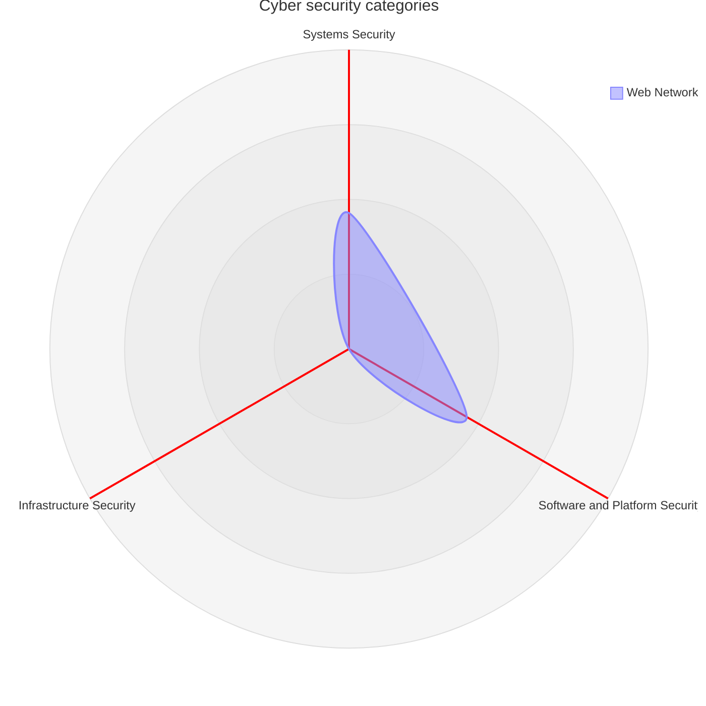
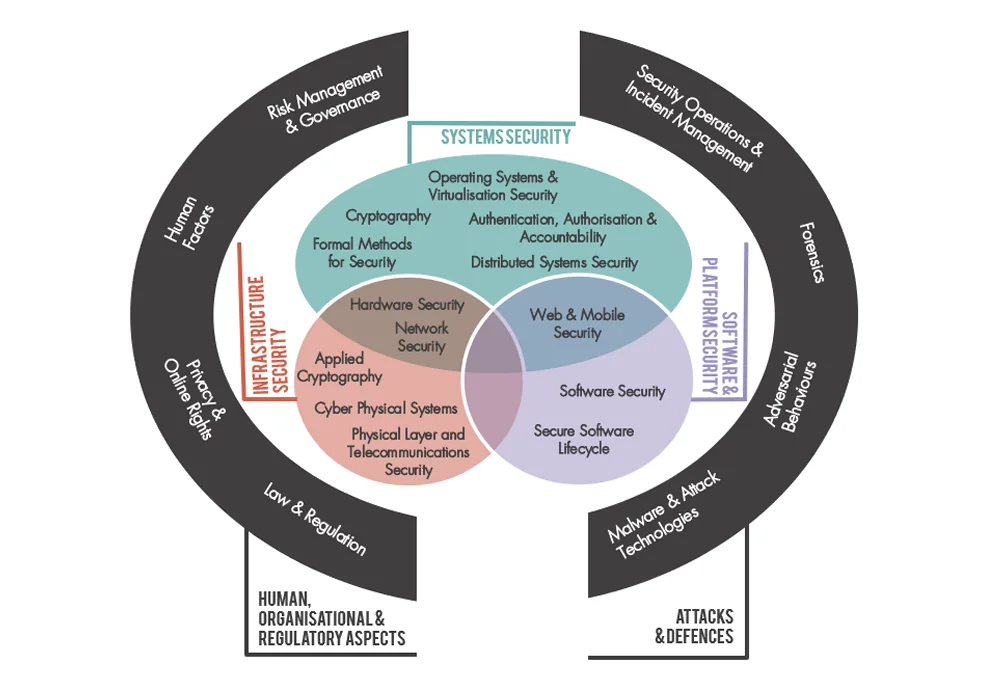

# Cyber Security

## Motivation

Cyberspace - the world of interconnect electronics - is fundamental in the modern world and many things are dependant on the internet, such as:

- Business
- Communication
- Information sharing

Cyber Security is necessitated by:

- Cybercrime
- Cyberterrorism
- Cyber warfare

## Definition

Cyber security is the process used to protect computers, networks, and programs from unauthorised access or attacks intended to harm an individual or organisation.

- Examples of harm are:
  - Financial loss
    - An individual may lose money through a cyber attack.
    - A business can also lose money through a halt in operations.
  - Data privacy breaches

> [!NOTE]
> The overall economic loss due to cybercrime is estimated at
> **$600 billion** annually (Lewis, 2018[^1]).

[^1]: Lewis J. A., 2018. _Economic Impact of Cybercrime_.Accessed at <https://www.csis.org/analysis/economic-impact-cybercrime>

## Categories

Cyber security can be split into three broad categories - which may sometimes overlap:

- Systems Security includes using elements such as firewalls, encryption, and passwords to control system access.

- Software Security refers to using the best coding practices to prevent bugs that lead to vulnerabilities.

- Infrastructure security consists of network and hardware security as well as cyber-physical and physical security.

## CIA Triad

A key part of cyber security is the conservation of **C**onfidentiality, **I**ntegrity,
and **A**vailibility, which guides the defense against threats and detecting problems.

> [!NOTE]
> Traditionally, information security focused on technical controls.
> Information securitty now includes social and human factors in security management.

### Confidentiality

- Protection against the risk of unauthorised access and information leaks, especially
  relating to a person's health and finances.
  - Personal information
  - Propriety information

### Integrity

- Traditionally, the protection of information from unauthorised modification.

- Also deals with social-technical issues, such as:
  - authenticity
  - non-repudiation
  - responsibility
  - ethicality
  - moral integrity
  - trust

### Availability

- Traditionally only preventing unauthorised access, denying illigitimate users
  from accessubg and modifying information.

- Also refers to creating systems that:
  - Promote security
  - Maintain efficiency

> [!IMPORTANT]
> Given the choice, users will prioritise convenience over security.
> Cyber security professionals need to find a balance between the two
> to minimise a user's vulnerability to cyber-attacks.

## Cyber-attacks

- Motivations for cyber-attackss may be:
  - Political
  - Harassment
  - Sabotage

### Cyber-enabled crimes

- A crime is deemed _cyber-enabled_ if it can be committed without technology, but
  is made easier with technology. This includes:
  - Cyberbullying
  - Doxing
  - Advance-fee fraud

> [!NOTE]
> **Scam baiting** involves wasting a scammer's time or resources to reduce
> the number of victims of their scams.

### Cyber-dependendent crimes

- May be carried out by criminals, activists, and states.
- These are facilitated by [malware](#malware).
- Cyber-dependent attacks that have a financial goal include:
  - Email spam: Unsolicited bulk communications used to entice people to buy fake products.
  - Phishing: A subset of spam tthat involves forgery of a legitimate source.
  - Financial [Malware](#malware): Records sensitive information like credit cards or login details.
  - Click Fraud: Bots that click on ads to defraud advertisers.
  - Unauthorised cryptocurrency mining
  - Ransomware: Users' files are encrypted and held for ransom using [malware](#malware).
  - Denial of service (DoS): Services are slowed down or disabled by consuming server resources.
    - Distributed Denial of Service (DDoS) attacks involves using a botnet to flood a target with requests.
  - Man-In-The-Middle(MITM) attack: Interception of data during transfer, giving access to an attacker, allowing them to insert [malware](#malware) or steal information.

> [!NOTE]
> An ideal solution against cybercrime would be where identities and data are protected
> without enabling criminals or terrorists tto hide behind privacy policies.

## Malware

### Types of Malware

#### 1. Standalone or dependent

Malware can either operate independently or rely on a host program.

##### Standalone

Worms and botnets are standalone because they are complete programs that run immediately once executed. These are generally easier to detect because they exist as separate executables.

##### Dependent

Viruses and malicious browser plug-ins are dependent because they require a host program.

- Viruses typically insert their own instructions into a legitimate program so that the malware runs alongside the intended code.

#### 2. Persistent or transient

Malware can differ in how long it remains on a system.

##### Persistent

Most malware is persistent, meaning it is stored somewhere in the file system and remains active across reboots.

##### Transient

Some malware resides only in memory. This transient malware disappears when the system is rebooted, making it more difficult for antivirus tools to detect.

#### 3. Layer of the system

Persistent malware can be installed at different layers of the system.

##### Deep layers

Malware embedded in firmware or the boot sector is significantly harder to detect because it runs before the operating system loads.

##### Higher layers

Malware affecting drivers or application programming interfaces (APIs) is easier to detect because it operates closer to the user space.

#### 4. Automatic or activated

Malware differs in how it begins execution.

##### Automatic

Auto‑spreading malware installs and runs itself without user interaction.

##### Activated

Some malware requires a user to execute it, often by clicking a link or opening an email attachment — usually unintentionally.

#### 5. Static or dynamically updated

Malware can differ in how it evolves over time.

##### Static

Traditional malware is static, meaning its code does not change once deployed.

##### Dynamically updated

More sophisticated malware can update itself by communicating with a malware server.

- This allows it to evade detection techniques by modifying its behaviour or signature after installation.

## Grey Areas

### Potentially Unwanted Programs (PUPs)

PUPs fall between legitimate software and malware. They are often bundled with free applications, such as mobile game apps, and commonly appear as adware that collects user data. Although users technically “agree” via terms and conditions, PUPs can behave maliciously and are therefore treated as malware in cybersecurity.

---

### How Malware Spreads

Malware spreads in two main ways:

#### Automatic Spread

- Exploits system vulnerabilities, loopholes, or backdoors.
- Can infiltrate through smart devices or IoT devices connected to a network.

#### Human‑Activated Spread

Common activation methods include:

- Downloading infected files from emails, websites, or file‑sharing platforms.
- Clicking malicious links that redirect to harmful pages.
- Visiting compromised websites where malware downloads automatically.
- Using infected USB drives or external storage devices.
- Falling victim to social engineering attacks that trick users into installing malware or revealing sensitive information.

---

### Social Engineering Tactics

Cybercriminals often manipulate emotions to encourage rash decisions.  
Common tactics include:

- Creating fear, excitement, urgency, or trust.
- Pretending to be a legitimate or authoritative source.

---

### Signs of Malware Infection

Typical indicators include:

- Slow system performance or long loading times.
- Unknown programs running in the background.
- Browser homepage changes or frequent pop‑up ads.
- System crashes in severe cases.
- For DDoS attacks: unusual spikes in network traffic or request volume.

---

### Responding to a Suspected Infection

- First step: run an antivirus scan.
- Popular antivirus tools include Norton, Bitdefender, and McAfee.
- Free options (e.g., Avast One Essential) offer basic protection.
- Consider detection rates and additional features such as password managers, safe browsing tools, or parental controls.
- Keep antivirus software updated, as malware often attempts to evade detection.
